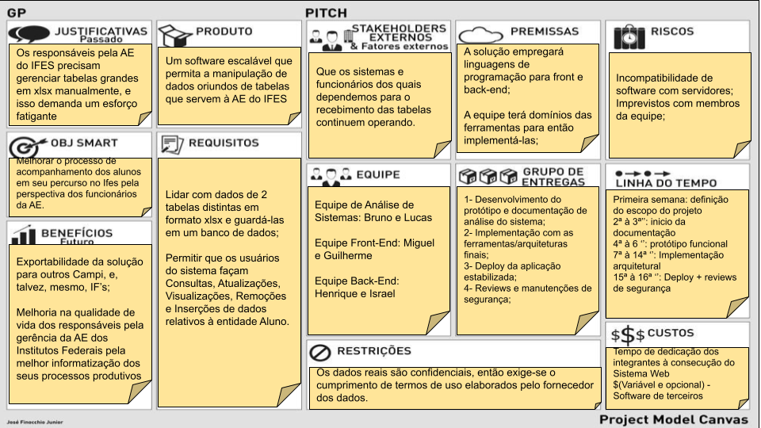
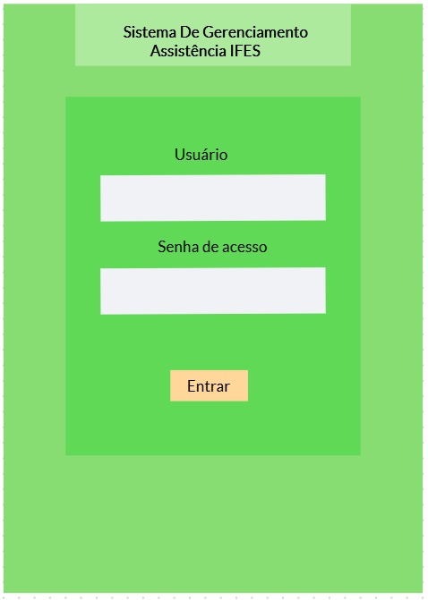
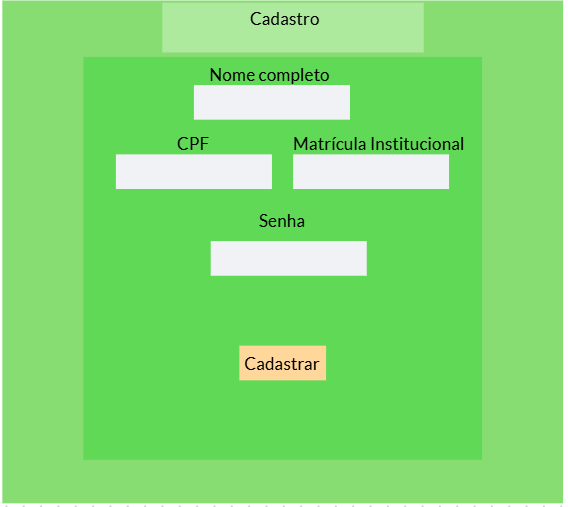
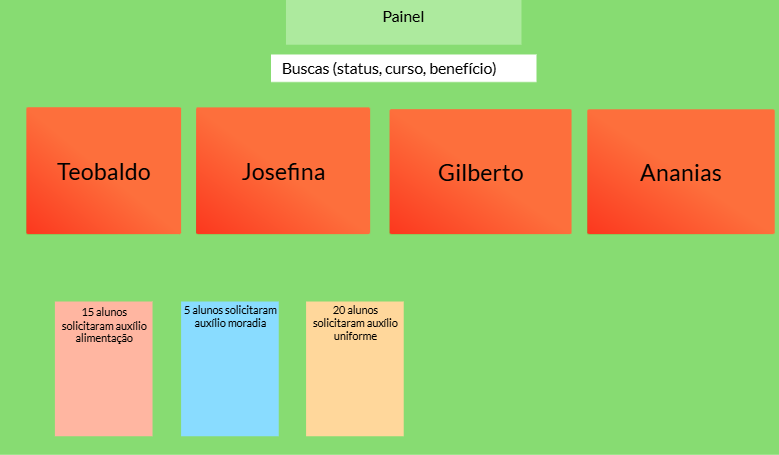
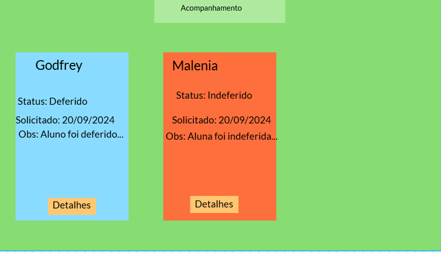
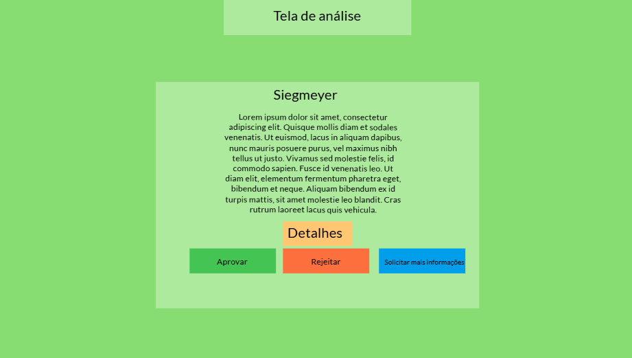
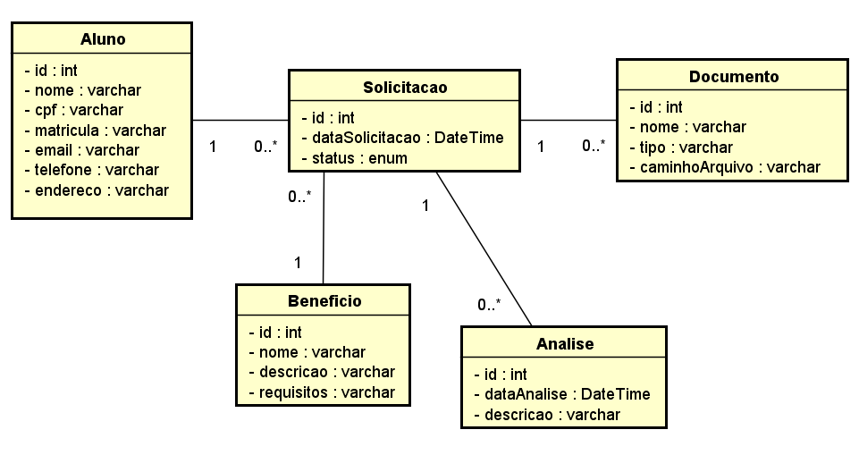

# 📘 Documentação do Projeto - Desenvolvimento Web

---

## 🧾 Visão Geral

Este projeto visa o desenvolvimento de um sistema institucional para cadastro e visualização de alunos. O sistema, destinado para uso da Assistência Estudantil, 
permite que os clientes visualizem dados dos alunos. A seguir, detalhamos os principais artefatos exigidos para a entrega.

---

## ✅ Backlog

| ID    | Prioridade | História de Usuário                                                                 |
|-------|------------|--------------------------------------------------------------------------------------|
| HU-1  | 1️⃣         | **No papel de cliente**, desejo **visualizar uma lista/tabela de alunos**, para poder consultar os seus dados. |
| HU-2  | 2️⃣         | **No papel de cliente**, desejo **filtrar os alunos de acordo com dados escolhidos**, para encontrar mais rapidamente quem eu procuro. |
| HU-3  | 3️⃣         | **No papel de cliente**, desejo **adicionar alunos na tabela**, para mantê-la sempre atualizada. |
| HU-4  | 4️⃣         | **No papel de cliente**, desejo **remover alunos da tabela**, para desfazer possíveis erros que eu possa cometer. |
| HU-5  | 5️⃣         | **No papel de cliente**, desejo **alterar dados dos alunos**, para manter a tabela atualizada ou desfazer possíveis erros. |
| HU-6  | 6️⃣         | **No papel de cliente**, desejo **consultar detalhes dos alunos**, para que eu possa consultar informações mais específicas, sem que essas poluam a tela principal. |
| HU-7  | 7️⃣         | **No papel de cliente**, desejo **visualizar solicitações dos alunos**, para que eu possa aceitá-las ou deferi-las. |
| HU-8  | 8️⃣         | **No papel de cliente**, desejo **confirmar ou deferir solicitações de benefícios dos alunos**, para garantir que os benefícios sejam concedidos justamente. |
| HU-9  | 9️⃣         | **No papel de cliente**, desejo **ver uma confirmação após eu confirmar ou deferir uma solicitação**, para ter certeza que deu tudo certo. |
| HU-10  | 1️⃣0️⃣       | **No papel de cliente**, desejo **ver uma confirmação após eu realizar uma ação de CRUD**, para ter certeza que deu tudo certo. |
| HU-11  | 1️⃣1️⃣       | **No papel de cliente**, desejo **me autenticar com login e senha**, para garantir que apenas eu e outras pessoas autorizadas tenham acesso ao sistema. |
| HU-12  | 1️⃣2️⃣       | **No papel de administrador**, desejo **gerenciar o acesso dos usuários**, para garantir que apenas pessoas autorizadas tenham acesso ao sistema. |

---

## 🎨 Protótipo de Telas

## 🎨 Protótipo de Telas

**Figura 1**: Tela de login com áres de usuário, senha e acesso.

**Figura 2**: Tela de cadastro do servidor, para o preenchimento de nome, CPF, matrícula institutcional e senha.

**Figura 3**: Tela de painel, contendo resumo de solicitações pendentes, busca personalizada e relatório diversos.

**Figura 4**: Tela de acompanhamento, contendo tabelas com status, datas, observações da análise e opção de visualizar detalhes.

**Figura 5**: Tela de análise, visualiza todas as informações da solicitação, contém botões Aprovar, Rejeitar, Solicitar mais informações, campo para observações, detalhes e acesso a documentos.

---

## 🏗 Análise e Projeto 

O projeto  do sistema:

### Diagrama de classes

### Esboço da arquitetura geral (cliente-servidor)

### Autorização e Autenticação 

### Tecnologias a serem utilizadas 
HTML, CSS, REACT, JavaScript

---

### Telas do sistema

